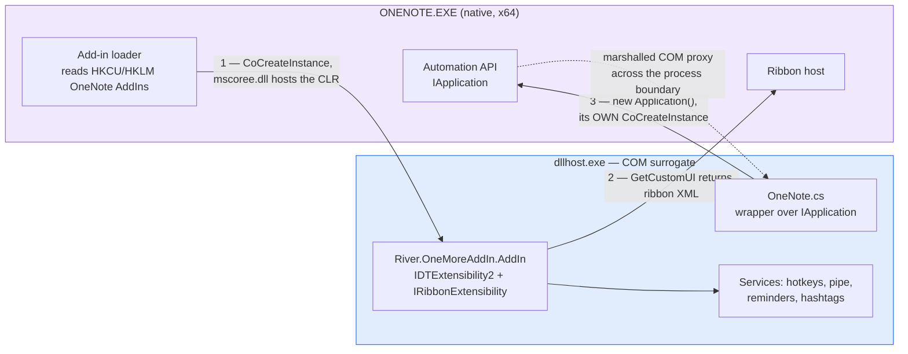
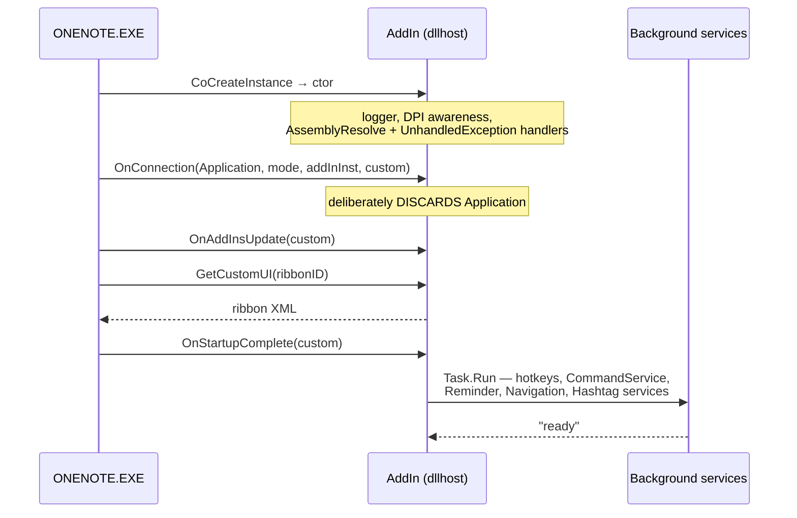
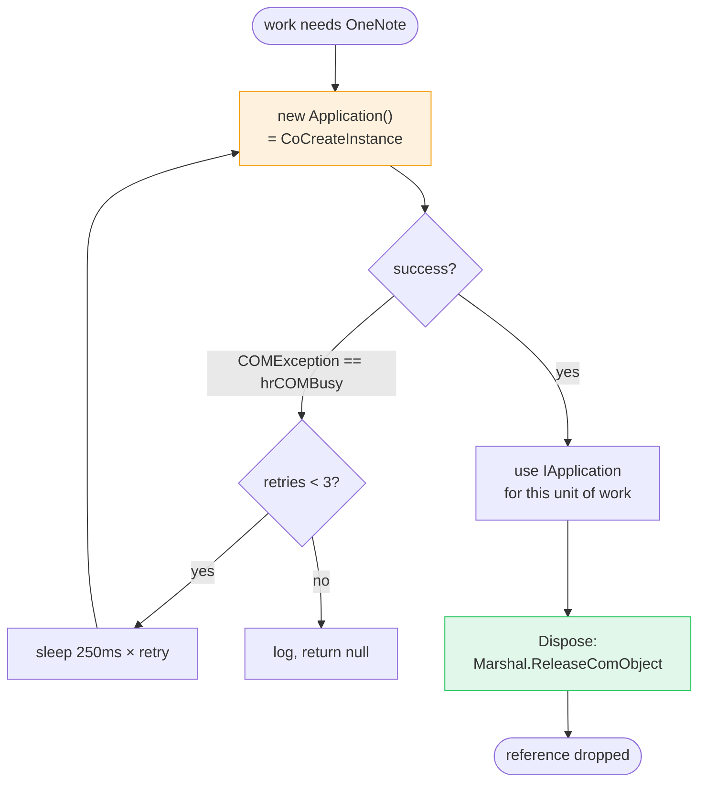
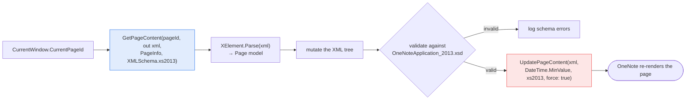
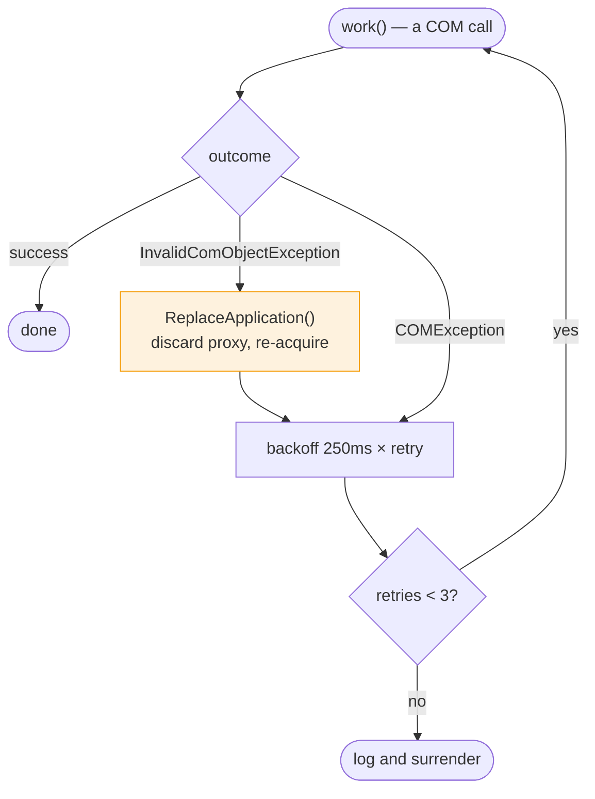
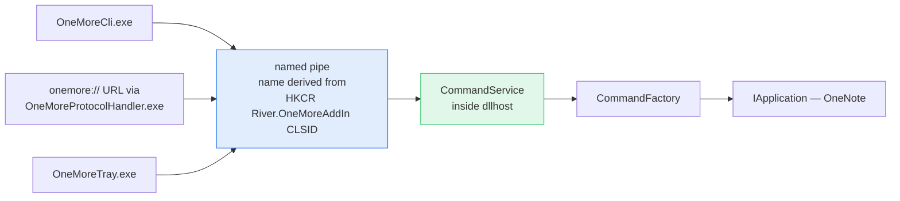

# How OneMore actually talks to OneNote

> **What this is:** a read of [OneMore][onemore] 7.3.0 by
> [Steven Cohn][steven-cohn] — the only known-good, actively-maintained consumer of
> the desktop OneNote COM API — done because RecallTape has to make every one of the same decisions.
> Source read from the EWC3 Labs fork at `C:\DEV\ewc3labs\OneMore`, plus the installed 7.3.0 build and
> live registry/process observation on `EWC3WS2`, 2026-08-11/12.
>
> **Licence caution: OneMore is MPL-2.0, RecallTape is MIT.** MPL-2.0 is *file-level* copyleft — a file
> derived from OneMore stays MPL-2.0 for good. **Read it, understand it, write our own.** Nothing here
> is a licence to paste. Where we deliberately adopt a technique, credit it.

---

## The short version

OneMore is not "an add-in that calls OneNote." It is **three cooperating things**:

1. a **COM class** that OneNote activates into a surrogate process,
2. a **client of OneNote's automation API**, which it obtains *itself* rather than accepting the one
   OneNote offers it,
3. a **long-lived service host** — hotkeys, pipes, background scanners — outliving any single
   command.

The second point is the surprising one, and it is the crux of this document.

---

## 1. Hosting topology

OneMore does **not** run inside `ONENOTE.EXE`. Its `AppID` carries an empty `DllSurrogate` value,
which moves the add-in into the generic `dllhost.exe` surrogate.



**Why a surrogate at all?** Isolation. A managed add-in loaded in-process would put the CLR,
WinForms, WebView2 and a SQLite provider inside OneNote's address space, and any unhandled exception
would take the host down with it. Out-of-process, a crash costs a `dllhost` and OneNote survives. It
also frees the add-in to set its own DPI awareness and run its own message loops.

The registration that produces this, from `OneMoreSetup/Registry.wxs`:

| Key | Value | Purpose |
| --- | --- | --- |
| `HKCR\CLSID\{guid}\InprocServer32` | `mscoree.dll` + `Class`/`Assembly`/`CodeBase`/`RuntimeVersion` | CLR hosts the managed class |
| `HKCR\CLSID\{guid}` | `AppID = {guid}` | points at the AppID below |
| `HKCR\AppID\{guid}` | `DllSurrogate = ""` | **run me in `dllhost.exe`** |
| `HKCR\AppID\{guid}` | `LaunchPermission` (binary SDDL) | see below |
| `HKCU` **and** `HKLM` `…\Office\OneNote\AddIns\River.OneMoreAddIn` | `LoadBehavior=3` | discovery; HKCU wins, HKLM is the Intune/SYSTEM fallback |
| `HKLM\…\EventLog\Application\OneMore` | `TypesSupported=7` | so a *non-admin* `dllhost` can write events |

Two of those encode hard-won knowledge worth stealing outright:

- **`LaunchPermission`.** Their own comment: on ARM64 Windows the machine-wide DCOM default launch
  security does not grant local-launch to `BUILTIN\Users`, so COM refuses to start `dllhost` and the
  add-in never loads. The explicit SDDL (`O:BAG:BAD:(A;;0x0b;;;AU)(A;;0x0b;;;SY)(A;;0x0b;;;BA)`)
  makes the implicit x64 grant explicit and costs nothing on x64.
- **The EventLog source, registered at *install* time.** Creating a source requires HKLM write
  access that a medium-integrity `dllhost` does not have. Without pre-registration the first
  `WriteEntry` throws a `SecurityException` **and masks the original error**. That is *"never let 'I
  don't know' render as 'OK'"*, expressed in registry keys.

---

## 2. The startup handshake

OneMore documents the call order in a comment, and a live run matches it exactly:



Everything real happens in `OnStartupComplete`, inside a `Task.Run` — not on OneNote's calling
thread. The host gets its thread back immediately.

### The load-bearing surprise

```csharp
// do not grab a reference to Application here as it tends to prevent OneNote
// from shutting down. Instead, use our ApplicationManager only as needed.
public void OnConnection(object Application, ext_ConnectMode ConnectMode, object AddInInst, ref Array custom)
```

**OneMore throws away the `Application` object OneNote hands it.** Holding that reference keeps a
COM proxy alive across the process boundary and OneNote will not exit. The reference OneNote offers
is a *liability*, not the foothold.

---

## 3. So where does the connection come from?

`ApplicationFactory.CreateApplication()` — and it just calls `new Application()`, which is
`CoCreateInstance` on the OneNote coclass. **The same call any external program makes.**



The pattern is **acquire late, release early, never cache**. A `OneNote` wrapper is constructed for
a unit of work, used, and disposed. `ApplicationFactory` exists largely as a seam for injecting a
mock in tests — good design in something that could easily have been a static singleton.

### COM lifetime discipline

```csharp
public void Dispose()
{
    Dispose(disposing: true);
    // DO NOT call this otherwise OneNote will not shutdown properly
    //GC.SuppressFinalize(this);
}
```

and inside, `Marshal.ReleaseComObject(onenote)` guarded by `Marshal.IsComObject`. That commented-out
`GC.SuppressFinalize` is not sloppiness — it is a deliberate, comment-documented inversion of the
canonical dispose pattern, because the canonical version leaks a proxy that hangs OneNote's
shutdown. **Precisely the kind of thing that reads as a bug to a future maintainer and gets "fixed"
without that comment.**

---

## 4. The page read-modify-write cycle

The part RecallTape reimplements almost verbatim in concept.



Points that matter to us:

- **The schema version is pinned explicitly** — `XMLSchema.xs2013` on both read and write, never the
  default. The repo carries `Reference/0336.OneNoteApplication_2013.xsd` and validates against it
  before writing.
- **`PageInfo` selects the detail level.** `piSelection` is the one RecallTape needs: the page with
  the current selection marked. `piBinaryData` pulls image bytes; `piAll` gets everything and is
  expensive.
- **`UpdatePageContent(xml, DateTime.MinValue, xs2013, true)`** — the second argument is
  *expectedLastModified*, the fourth is *force*. `DateTime.MinValue` + `force: true` **disables
  OneNote's optimistic-concurrency check.** It always wins, even if the page changed underneath.
  Defensible for OneMore's "user pressed a button just now" model. **Not obviously right for
  RecallTape**, which writes on a study-loop cadence against pages syncing from other devices. See
  §9.

---

## 5. Resilience: every call is wrapped

No raw COM call goes unguarded. `InvokeWithRetry` handles the two failure modes *separately*:



The distinction is the insight. A **`COMException`** usually means *OneNote is busy* — wait and
retry the same proxy. An **`InvalidComObjectException`** means *the proxy itself is dead* — retrying
it is pointless, so `ReplaceApplication()` discards it and re-acquires. Two failure shapes, two
responses, bounded attempts. Treating them identically yields either a hang or a false negative,
depending on which one you guessed.

---

## 6. The external channel — the "reverse COM proxy"

OneMore solves the problem we hit head-on: *external processes cannot usefully drive OneNote*. Its
answer is to make the **add-in** the server.



`CommandService` runs a named-pipe listener on its own thread: 4096-byte cap, 5-second read timeout,
tolerating up to 5 consecutive errors before giving up rather than spinning forever.

**Note the security work**, invisible until it isn't: the action name from the URL flows into
`Type.GetType`, which accepts assembly-qualified names (`Foo, SomeAssembly`) and nested-type syntax
(`Outer+Inner`). A regex — `^[A-Za-z_][A-Za-z0-9_]*$` — clamps it to a plain identifier so neither
can be smuggled in via a `onemore://` link. A URL protocol handler is an *internet-reachable* entry
point into a process holding a live handle on your notes. That regex is load-bearing.

---

## 7. Hotkeys

Directly relevant, because RecallTape's entire study loop is a hotkey.

- Commands carry a `[Command]` attribute; `RegisterHotkeys()` **discovers them by reflection** and
  binds each one. 63 registered on our live run.
- Binding uses Win32 `RegisterHotKey` against a hidden `MessageWindow` — a `Form` running its own
  `Application.Run` loop on a dedicated thread inside `dllhost`. Global hotkeys need a window and a
  message pump; an add-in has neither by default, so it makes one.
- User overrides come from settings, and defaults can be skipped per-locale. Their example: on
  non-US layouts `AltGr` *is* `Ctrl+Alt`, so a default `Ctrl+Alt+OemPlus` binding collides with
  typing a square bracket. They skip the default on those locales but honor an explicit user binding
  regardless.

That locale detail is a free lesson. RecallTape's headline binding is **`Ctrl+Alt+T`** — worth
checking against non-US layouts *before* it ships in a README.

---

## 8. What we verified on this machine, and what we did **not**

Stated explicitly, because an earlier version of this analysis over-claimed.

**Verified by direct observation:**

- OneMore 7.3.0 loads on Office **16.0.20228.20158** (Current Channel, x64): `OnConnection`,
  `OnStartupComplete`, ribbon built, 63 hotkeys, services started, `ready`.
- It runs in `dllhost.exe`, per both its own log and the `AppID`/`DllSurrogate` registration.
- Its startup line `OneNote 15.0 (16.0.20228.20158 x64)` is **not** evidence that the API works. The
  version comes from `HKCR\OneNote.Application\CurVer`; the build number from `ONENOTE.EXE`'s file
  header. Both are local reads. No COM call is involved.

**Verified later the same day.** OneMore's `ConvertMarkdownCommand` — which reads the page *and*
writes it back — ran clean on this build. Our own add-in then read real page XML off 79 pages of a
real notebook. `GetPageContent` works; `UpdatePageContent` is proven by OneMore's behavior, and by
our own code once `RT-03` lands.

That result is worth stating precisely, because it is counter-intuitive. **External automation is
measurably dead here:** `CoCreateInstance("OneNote.Application")` returns an object whose every
method returns `E_FAIL` — including `GetSpecialLocation`, which touches no notebook —
`Application.Windows` is null, and OneNote never registers in the ROT (`MK_E_UNAVAILABLE`). Excel
and Word, same host and same script, answer normally.

And OneMore reaches OneNote through **`new Application()` — that same `CoCreateInstance`**, and it
works. So:

> **The identical call returns a dead object to an external process and a live one from inside a
> OneNote-spawned add-in surrogate.** Whatever gate Microsoft added, it is on the *caller*, not the API.

That is the single most important fact about this platform, and it is why RecallTape has no
scripting fallback to design around.

**Corollary we paid for:** the surrogate only accepts the real PIA types. A hand-declared
`IDTExtensibility2` with the correct IID, dual layout, typelib method order, explicit DispIds and
`[TypeIdentifier]` is constructed by OneNote and then never called. `dynamic` fails too — the C# COM
binder needs `IDispatch::GetTypeInfo`, which OneNote refuses. Use the PIAs.

---

## 9. What RecallTape should take, and what it should do differently

**Take:**

| Technique | Why |
| --- | --- |
| Surrogate hosting (`DllSurrogate=""`) | a crash costs a `dllhost`, not somebody's notes |
| Explicit `LaunchPermission` SDDL | ARM64 Surface devices are *exactly* our target hardware |
| Pre-registered EventLog source | otherwise the first error hides the real error |
| `InvokeWithRetry` with two failure shapes | busy and dead need different responses |
| Never cache `IApplication`; acquire per unit of work | caching hangs OneNote's shutdown |
| The `GC.SuppressFinalize` inversion, **with its comment** | the comment is the deliverable |
| Pin `XMLSchema.xs2013` on every call | never inherit a default that can move |
| Validate against the XSD before writing | our writes land on medical school notes |
| Reflection-discovered commands and hotkeys | one attribute per command, no parallel registry |
| Regex-clamp anything reaching `Type.GetType` | ours becomes internet-reachable the day we add a protocol |

**Do differently:**

1. **Do not blanket `force: true` on `UpdatePageContent`.** OneMore's `DateTime.MinValue` + force
   discards the concurrency check. RecallTape writes during a study loop against pages syncing from
   a Surface and a phone. *"Never damage someone's notes"* is our first non-negotiable, and
   last-write-wins is the exact shape of the bug that violates it. Pass the real
   expected-last-modified, handle the mismatch, and force only where we can prove it safe.
2. **Keep `RecallTape.Core` free of every word of this.** All of it belongs to `RecallTape.OneNote`.
   The moment `Core` learns what `XMLSchema.xs2013` is, the Anki and PDF hosts are dead.
3. **No telemetry.** OneMore ships with telemetry on by default plus a tray process. That is its
   call; ours is already made in `PLAN.md`.
4. **Sign the installer.** OneMore's MSI carries no Authenticode at all. Copy that and we inherit
   the SmartScreen problem.
5. **Fewer moving parts at v1.** OneMore is a mature multi-process product — CLI, tray, protocol
   handler, calendar app, SQLite hashtag index. RecallTape needs a ribbon, a hotkey, and a page
   round-trip. Grow into the rest, or don't.

---

## Sources

- OneMore source, EWC3 Labs fork of `stevencohn/OneMore` @ 7.3.0 — `OneMore/AddIn.cs`,
  `OneMore/OneNote.cs`, `OneMore/Helpers/ApplicationFactory.cs`, `OneMore/AddInHotkeys.cs`,
  `OneMore/Helpers/Hotkeys/HotkeyManager.cs`, `OneMore/Commands/CommandService.cs`,
  `OneMore/Helpers/SessionLogger.cs`, `OneMore/Helpers/Office/Office.cs`,
  `OneMoreSetup/Registry.wxs`
- Installed OneMore 7.3.0 (`C:\Program Files\River\OneMoreAddIn`), its `%TEMP%\OneMore.log`, and
  live registry/process observation on `EWC3WS2`, Office 16.0.20228.20158 x64
- Microsoft, [Application interface (OneNote)][application]

**Credit where it is due:** Steven Cohn has maintained this against an undocumented, shifting target
for nine years. Several comments in that codebase are worth more than the code around them.

[application]: https://learn.microsoft.com/en-us/office/client-developer/onenote/application-interface-onenote
[onemore]: https://github.com/stevencohn/OneMore
[steven-cohn]: https://github.com/stevencohn
