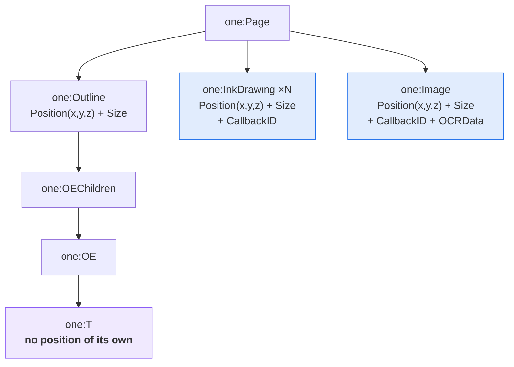
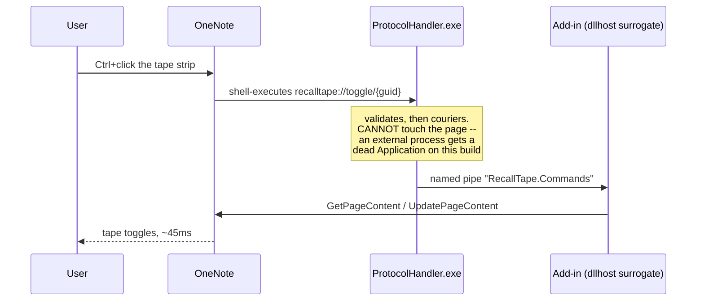

# What OneNote page XML actually contains

> **Receipts for the Phase 0 spike.** Everything here was measured on 2026-08-12 against real pages
> through the RecallTape add-in — a synthetic test page, and 79 pages of Paul's real medical-school
> notebook. Office 16.0.20228.20158, Current Channel, x64, schema `xs2013`.
>
> Raw survey output: [`onenote-content-survey-raw.txt`](onenote-content-survey-raw.txt).
> How we can reach the API at all:
> [`onemore-onenote-interaction.md`](onemore-onenote-interaction.md).

---

## 1. Selection is fully identifiable

`selected` is **not** boolean. It is `none | partial | all`, per the schema:

> *none: no selection on this object or any of its children*
> *partial: this object contains at least one selected object*
> *all: this object is selected (or all its children are selected)*

So finding the selection is a descent, not a scan:

```text
Page      selected="partial"
└─ Outline    selected="partial"
   └─ OEChildren selected="partial"
      └─ OE        selected="partial"
         └─ T         selected="all"     "This is a Markdown heading"
```

**Anything checking `selected == "true"` finds nothing, silently, forever.**

## 2. There are two anchor worlds

This is the finding that changes the design.



**Flow content** — typed text — lives *inside* an `Outline`. The `T` has no coordinates; OneNote lays
it out. Masking it means acting on the content.

**Positioned content** — ink and images — lives at **page level**, each with absolute
`Position(x, y, z)` and `Size(width, height)`. Masking it means acting on coordinates.

`docs/design/architecture.md` modelled `Tape.anchor` as one thing. **It is two.** A design that only
anchors into content cannot mask an image, and a design that only anchors to coordinates cannot follow
reflowing text.

## 3. The tape mechanism: a positioned Image at the top of the z-stack

There is **no `one:Shape`** in the schema — no rectangle, ellipse, or line element. The only way to put
an opaque region over arbitrary content is an `<one:Image>`:

```xml
<one:Image>
  <one:Position x="198.0" y="464.4" z="22"/>
  <one:Size width="96.0" height="96.0"/>
  <one:Data>{base64 PNG}</one:Data>
</one:Image>
```

`z` is dense and ordered — on the test page ink occupied `z=1..20` and an image `z=21`, so tape goes at
`z=22`. This is native, it persists in the page, and it syncs.

## 4. Ink: many small drawings, and the strokes are not inline

One lasso-selected doodle came back as **19 separate `InkDrawing` elements**, each with its own
`objectID`, `Position` and `Size`. Union bounding box: `x=70.5, y=293.4, 519.0 × 81.4`.

**Masking ink is bounding-box arithmetic, not stroke manipulation.** Each element carries only a
`CallbackID`; the stroke bytes come separately via `GetBinaryPageContent`. That is why the same page is
12 KB without binary data and 50 KB with it.

**We never touch ink data to mask ink.** Non-destructive by construction rather than by discipline.

## 5. What real notes are made of — 79 pages of Paul's notebook

| Element | Count | Note |
| --- | ---: | --- |
| `InkDrawing` | **11,685** | his handwriting |
| `InkWord` | **0** | — |
| `InkParagraph` | **0** | — |
| `Image` | 1,131 | ~14 per page |
| `Image` with `OCRData` | 1,061 | 94% |
| `OCRToken` | **92,558** | |
| `T` (typed text) | 892 | |
| `XPSFile` | 29 | printouts |
| `Table` | 1 | |

Two conclusions, both load-bearing.

### 5a. Handwriting recognition is absent

**Zero `InkWord` across 11,685 ink elements**, so `recognizedText` is not available. "Tape all
handwriting" must cluster `InkDrawing` bounding boxes ourselves — no free word or line segmentation.

`InkWord` is *not* the Ink-to-Text command. Ink-to-Text produces a plain `<one:T>`, which the text path
already handles. `InkWord` is ink that stays ink but which OneNote classified as a **word** rather than
a **drawing** — the schema gives it `Space` and `EndOfLine` children, while `InkDrawing` gets
`ShapeInfo`. On this build, with these users, OneNote classified everything as drawing.

**Unresolved:** whether that is the build, a setting, or an artifact of the notebook having been copied.
Cheap test: run *Survey Notebooks* against a live notebook on a Surface. Until then, design for
`InkDrawing` and treat `InkWord` as a bonus.

### 5b. The notebook is ink and images. Typed text is a rounding error.

892 typed elements against 11,685 ink and 1,131 images. **`PLAN.md`'s phase order was backwards for the
actual user**: Phase 1 was typed-text taping, Phase 2 was ink and regions. Phase 2 is his entire
notebook.

Paul said as much himself before the data arrived — *"I'm often covering pictures and printouts."*

## 5c. Text runs: OneNote splits at the selection boundary

A `one:T` is a **text run, not a line**. Asking for `piSelection` makes OneNote materialise the
selection as its own run:

```xml
<one:T selected="all"><![CDATA[<span style='background:black;mso-highlight:black'>WHOOMP! DE</span>]]></one:T>
<one:T>            <![CDATA[<span style='background:black;mso-highlight:black'>RE IT IS!</span>]]></one:T>
```

One visual line, two runs, split exactly where the selection ended.

**This makes character-level text taping free.** The run marked `selected="all"` *is* the characters the
user picked, so there is no offset arithmetic and no need for start/end markers in the content -- an
approach we considered and did not need.

Rich text lives as HTML inside the CDATA: `<span style='...'>`, `<br />`. Styling a run means wrapping
its CDATA in a span, which is purely additive -- removing the span restores the original byte for byte.

**Trap:** a hand-made black-on-black using only `background` + `mso-highlight` appears to work, but only
because the text was already black. Coloured text stays perfectly readable on the bar. `color` is what
hides the glyphs; set all three.

**Consequence for the design:** text tape needs no anchor. Restyled text *is* the text, so it reflows,
re-wraps and moves with its container. The anchoring problem exists only in the positioned world.

**Free interaction, and a leak:** selecting over taped text reveals it, because OneNote inverts colours
on selection. That is a peek gesture for zero code -- and also means a stray drag or Ctrl+A reveals
every answer on a page. Overlay tape has no equivalent gesture at all, so reveal is currently
asymmetric between the two mechanisms.

## 6. The gift: OneNote already knows where every word in every image is

`OCRToken` carries per-word geometry:

| Attribute | |
| --- | --- |
| `x`, `y`, `width`, `height` | bounding box within the image |
| `line`, `region` | reading-order grouping |
| `startPos` | offset into the sibling `OCRText` |

**92,558 tokens, across 94% of his images.** Every lecture slide and printout has already been OCR'd
with a box per word.

Image occlusion — the Goodnotes feature Paul actually wants — becomes tractable: offer *"tape this term
on the slide"* and place the overlay at coordinates OneNote supplied, instead of making the user draw
rectangles. It also restores the Anki path that 5a took away: the content under tape on a printout is
**known text**, even though handwriting is not.

## 7. Click-to-peek: the three-process chain

`origins.md` rated clicking a tape strip directly at 7-8/10 difficulty and steered to hotkeys instead.
It works -- and it needs three processes, because OneNote will not serve an external caller.



**Why a courier and not just the handler:** external automation is dead. Only code inside the surrogate
can touch a page, so the outside world cannot reach in and the add-in has to listen. Same shape OneMore
uses for `onemore://`.

**What makes it clickable:** `one:Image` carries a `hyperlink` attribute, and OneNote both preserves it
through `UpdatePageContent` and renders it as a real link with hover text. Following it needs
**Ctrl+click**, OneNote's convention.

**Office warns about unfamiliar protocols** unless the scheme is registered under
`Policies/Microsoft/Office/16.0/Common/Security/Trusted Protocols/All Applications/`. Without that
entry, every peek costs a dialog. Found by reading OneMore's `Registry.wxs`.

**Peek swaps the payload; it does not delete the element.** Toggling replaces the image bytes with a
fully transparent 70-byte PNG and flips the `alt` state marker. Position, size, identity and hyperlink
survive, so revealed tape stays clickable and can be put back -- and the state lives in the element
rather than a side table that could drift out of sync with the page.

**Never re-read binary you are about to overwrite.** A `piBasic` read returns `one:CallbackID` rather
than inline `one:Data`. The fix is to drop whichever reference is present and write fresh `Data`, so a
peek costs a 12 KB read and a 70-byte write instead of 50 KB.

**Both surfaces validate.** The courier is reachable by anyone -- a `recalltape://` link can be planted
in any document -- so it accepts only `verb/guid`, and the add-in re-validates on receipt rather than
trusting an executable a hostile caller could invoke directly.

## 8. Background images: why some things cannot be taped

Measured 2026-08-13 across three real pages.

**A page background is a `one:Image` with `backgroundImage="true"`.** OneNote never lets the user
select one, so it is **always `selected="none"`** no matter where they click. Selection-driven taping
therefore cannot reach it — not a bug in our selection walk, a property of the content.

**They sit at the BOTTOM of the z-stack** — `z=0..38` on a printout page, while ordinary images were
`z=391..394`. So the overlay mechanism itself is fine: tape at `z=max+1` covers a background
comfortably. **The missing capability is naming a region, not covering one.**

**Workaround that works today:** scribble over the area with the pen, select the ink, tape it. Ink is
selectable and positioned, so its bounding box becomes the tape. Confirmed on a page with 38 ink
strokes over two background images.

### A PowerPoint attachment becomes 39 background images

Inserting a `.pptx` printout produces:

| Element | What it is |
| --- | --- |
| `one:InsertedFile` | the original file — `pathSource`, `pathCache`, `preferredName` |
| `one:XPSFile` | the rendered document, `xpsFileIndex` + `idDocument` |
| `one:Image` × 39 | one per slide, every one `backgroundImage="true"` **and** `isPrintOut="true"` |

**Every one of those 39 carried `OCRData`** — 449 `OCRToken`s across the deck.

That unblocks the interesting half of the feature: a lecture printout is not an opaque picture, it is
39 OCR'd pages with a bounding box per word. **Occluding a term on a slide is reachable without the
user drawing anything** — which is a better feature than the one that was asked for.

## 9. Page XML is full of personal data

Anything that ships page XML off the machine — a bug reporter, a support attachment, a paste into an
issue — is handling this. From ONE page of a real notebook:

| Leak | Example |
| --- | --- |
| Local paths, incl. usernames | `C:\Users\pkrei\OneDrive\00 LECOM\Anatomy\Radiology\SPINE (5) (4).pptx` |
| Author name and initials | `author="paul reilley"`, `authorInitials="pr"` |
| Microsoft account IDs | `cid=...` inside `authorResolutionID`, 4 per page |
| Page title | `Rad Spine` |
| **Full OCR text of every slide** | 39 `OCRText` blocks — the entire lecture |

That last row is not only a privacy question. Lecture slides are **someone else's copyrighted
material**, and a public issue is publication.

**Consequence:** "attach the page XML" is never a one-click feature. It needs a scrubber that strips
paths, identity and content, and it needs the user to see what will be sent before it is sent.

## 10. Sync conflicts exist and are invisible to us

Opening a shared notebook for the first time showed OneNote's manual "sync conflict" markers,
already present, from the owner's own history across his devices. **Nothing to do with RecallTape** —
the notebook arrived in that state before our add-in ever touched it.

That is the point. It means conflicted pages are a *normal ambient condition* of the notebooks we
will be asked to tape, not an edge case we might provoke.

**And the API cannot see them.** There is no `isConflictPage`, no conflict element, nothing in the
page or hierarchy schema — checked. We cannot detect a conflicted page, warn about one, or decline
to write into one. The nearest relative is `Page/@hasFutureContent` (content written by a newer
OneNote than the one now reading it), which is a different symptom of the same multi-client problem.

### Is there version history? Not in the API. But there is a recovery path.

Asked directly, and worth having the answer written down. Of the 29 methods on `IApplication`, **not one
touches page history** — no `GetPageVersions`, no version parameter on `GetPageContent`. OneNote the
*application* has page versions (History tab) and a recycle bin; OneNote the *API* does not expose either
as history.

What the API does expose, which adds up to the same thing:

- `GetSpecialLocation(slBackUpFolder)` — the automatic backup folder.
- `OpenHierarchy(path, ...)` takes a **file path** with `cftNone`, so a backup `.one` opens as a section
  and yields an objectID.
- `GetHierarchy` then `GetPageContent` on that objectID reads the **old** page XML.
- Separately, `SectionGroup/@isRecycleBin` marks the recycle bin, so deleted pages are enumerable.

Chained, that is a working recovery and diff path: read what a page looked like at backup time and
compare it to now. Enough to answer "did the tape survive?" empirically rather than by argument.

**And it is not hypothetical.** OneNote had already backed the shared notebook up locally — 15 `.one`
files, one section of it 153 MB — dated before our add-in touched anything. The safety net was already
under us. Users should be told it exists; it is the honest answer to "what if this thing eats my notes."

Note the scale in that number. A 153 MB section is the working environment, not an outlier.

So we will tape conflicted pages blind. What is unknown, and worth an hour before the study loop:

- Does `GetPageContent` return the page the user is looking at, or one side of the conflict?
- Does a tape survive the user resolving the conflict manually, or is it discarded with the losing
  side — leaving `RecallTape:` markers pointing at content that no longer exists?
- Does `UpdatePageContent` on a conflicted page make the conflict worse?

Two properties bear on it, and only one is settled:

- **Optimistic concurrency, already on.** We pass the real `expectedLastModified` with `force: false`,
  so OneNote refuses a stale write rather than clobbering — the reason we declined OneMore's
  `DateTime.MinValue` + `force: true`. This protects against overwriting a change we did not see. It
  says nothing about conflict resolution, which happens below us.
- **We write the whole page back.** `UpdatePageContent` takes the entire page, so taping one word
  rewrites every element on a lecture page. This has not been shown to cause anything. It is simply a
  larger footprint than the change deserves, and a larger footprint is a worse position from which to
  meet a sync layer we cannot inspect. Whether the API accepts a partial page — just our element and
  its `objectID` — is untested; the reference implementation always sends whole pages.

**Consequence:** write as little as possible, as rarely as possible. That is also an argument against a
study loop that persists reveal state on every interaction. That is `RT-32`.

## Open questions this raises

- Does `objectID` survive a sync round-trip between two machines? That decides whether it is a durable
  `Tape.anchor` or whether tape orphans itself. A shared notebook makes this testable.
- Does `InkWord` ever appear on a live pen-first notebook?
- What does `UpdatePageContent` do to `z` ordering and layout when an `Image` is inserted at page level?
- Do `OCRToken` coordinates share the page coordinate space, or are they image-relative? (Almost
  certainly image-relative — needs confirming before any overlay is placed from them.)
