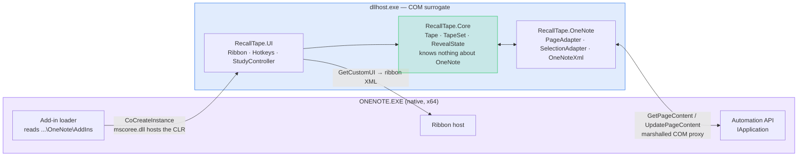

# Architecture

> Why RecallTape is built as an engine with a host, rather than as a OneNote add-in that happens to
> mask things. Background and citations: [`../origins.md`](../origins.md).

---

## The decision that shapes everything

**`RecallTape.Core` must not know what OneNote is.**

```text
RecallTape.Core       Tape · TapeSet · RevealState · StudySession · Persistence
                      ↑ no COM. no page XML. no Office references. ever.
RecallTape.OneNote    PageAdapter · SelectionAdapter · OneNoteXml · OverlayRenderer
RecallTape.UI         Ribbon · Hotkeys · StudyController

                      ── later, and only possible because of the line above ──
RecallTape.Anki   ·   RecallTape.PDF   ·   RecallTape.Web
```

Masking-for-recall is a general idea: *a region of a document, hidden, revealable, with study state
attached.* OneNote is the first place we need it, not the only place it makes sense. Keeping the
model host-free is what lets an Anki exporter, a PDF host, or an Office.js web edition reuse the
engine instead of reimplementing it.

**This is the project's A.B.S. line** (see `AGENTS.md`). When `Core` starts importing OneNote types
— and something will always want to, usually for a "quick" reason — that is the bug. Fix it then,
not "later," because later is when there are three hosts and the leak is load-bearing.

---

## Why desktop C# and not Office.js

Decided in `origins.md` with citations. Short version:

| | OneNote for Web | **OneNote Windows desktop** |
| --- | --- | --- |
| API | Office.js | COM / desktop API |
| Microsoft's docs target | this one, explicitly | still documented, older |
| Marketplace | yes | no useful one |
| Reaches your **ink** | not meaningfully | **yes** |
| Where lecture notes actually happen | no | **yes** |

The modern, better-documented, marketplace-friendly API is the one that cannot serve the actual
user: a medical student taking pen notes on a Surface in a lecture hall. So we take the older API
and the harder distribution story, because that's where the notes are.

**The foothold:** the desktop API returns the current page as XML *with the selection identified*,
and accepts a modified page back via `UpdatePageContent`. That single capability is what makes the
whole product possible.

> ⚠️ **The foothold is narrower than it looks.** On Office **16.0.20228** (Current Channel) OneNote no
> longer serves *external* automation clients at all: `CoCreateInstance("OneNote.Application")` returns
> an object whose every method fails `E_FAIL`, and OneNote never registers in the Running Object Table.
> The foothold exists **only for a registered add-in**. There is no scripting fallback, no external
> harness, and nothing in this design may assume one. Evidence and reproduction:
> [`../RAG_Sessions/2026-08-12_OneNote_Desktop_COM_External_Automation_Returns_E_FAIL_On_Current_Channel.md`][rag-sessions-2026-08].
>
> **Still unproven:** that a `GetPageContent` round-trip succeeds *from inside the add-in surrogate*.
> Until that is demonstrated, treat the platform as promising rather than settled.

---

## How it is actually hosted

The add-in does not run inside `ONENOTE.EXE`. Its `AppID` carries an empty `DllSurrogate`, which
moves it into the generic `dllhost.exe` COM surrogate — the same arrangement OneMore uses.



**Why a surrogate:** an in-process managed add-in puts the CLR and our UI inside OneNote's address
space, where an unhandled exception takes the host — and the user's notes — down with it. Out of
process, a crash costs a `dllhost`. It is also the only arrangement observed to work: registered
plainly in-process, OneNote demotes `LoadBehavior` 3 → 2 and never constructs the class.

**Note where `Core` sits.** It is in the surrogate because everything is, but it is reached only
through `RecallTape.OneNote`. The process boundary is not the architectural boundary — the A.B.S.
line above is.

### Runtime and build

| Decision | Value | Why |
| --- | --- | --- |
| Target framework | **`net48`** | present on every Windows 10/11 machine — a student installs tape, not a runtime. Also what the reference implementation targets. |
| Build driver | .NET SDK 8.x | builds SDK-style `net48` projects without Visual Studio. CI's `dotnet-version: 8.0.x` is the *driver*, **not** the target — do not "fix" it to `net8.0`. |
| COM interfaces | hand-declared | `TlbImp.exe` needs the Windows SDK; a build box with the .NET SDK alone must still work, and so must CI. |
| Registration | `RegAsm /codebase` + `AppID`/`DllSurrogate` + `LoadBehavior=3` in HKCU and HKLM | see `tools/register.ps1` |

## Standing on OneMore

[OneMore][onemore] (Steven Cohn, open-source C#) already solved add-in registration, ribbon
integration, hotkeys, and page XML manipulation for desktop OneNote. Rebuilding that plumbing to
prove a point would be foolish.

**Resolved 2026-08-12: reference implementation only.** OneMore is **MPL-2.0**; RecallTape is MIT,
and HQ treats that as non-negotiable. MPL-2.0 is *file-level* copyleft, so any forked file stays MPL
permanently. We read it, understand it, and write our own — and credit it prominently, per
`AGENTS.md`.

A full read of how it works, with diagrams, is in
[`../analysis/onemore-onenote-interaction.md`][analysis-onemore]. It is the best available
documentation of this API, because it is the only one that runs.

---

## The tape model (sketch)

```
Tape          one masked region: anchor into host content, original payload, reveal state
TapeSet       all tapes on a page/section, ordered for the study loop
RevealState   hidden · revealed · permanently removed
StudySession  a pass over a TapeSet — order, position, hits, misses
Persistence   where tape state lives across sessions
```

**The hard part is `Tape.anchor`.** It has to survive the user editing around it, OneNote syncing
the page, and the page being reopened later. A brittle anchor produces orphaned tape, which looks
like data loss even when it isn't. Expect to iterate here — and per house method, expect to tear the
first version out once the failure modes are visible.

**`Persistence` is an open question**, deliberately unresolved in `PLAN.md`: tape state inside the
page XML travels with the content and survives sync, but is fussier to write; state stored beside
the page is easy and risks orphaning. Decide with a spike, not with an argument.

## Non-destructive, always

The original content and its metadata are preserved on tape and restored on removal. Not "usually" —
always, including when a write fails half-way. Belts and suspenders on anything that rewrites a
page: these are somebody's notes, and there is no undo button that reaches back to last Tuesday.

**Concurrency is part of "non-destructive."** `UpdatePageContent` takes an *expectedLastModified*
and a *force* flag. OneMore passes `DateTime.MinValue` with `force: true`, which disables the check
entirely — a reasonable call for "the user pressed a button just now."

**RecallTape must not copy that.** We write on a study-loop cadence, against pages that sync from a
Surface, a phone, and a laptop. Last-write-wins is precisely the shape of the bug that silently eats
somebody's lecture notes. **Pass the real expected-last-modified, handle the mismatch, and force
only where it can be shown safe.** If that turns out to be unworkable, it is a design decision to be
made deliberately and written down here — not a default to be inherited.

## The study loop is keyboard-first

Not a compromise — a design conclusion from `origins.md`. Clicking individual tape strips is fiddly
on a tablet and slow everywhere. One key that reveals, then retapes and advances, turns a page of
notes into a loop you can run one-handed without looking down:

```
Space → answer → Space → answer → Space
```

Direct manipulation of individual strips, if it ever becomes achievable on the desktop canvas, is an
*addition* to this — never the thing it gets replaced by.

[analysis-onemore]: ../analysis/onemore-onenote-interaction.md
[onemore]: https://github.com/stevencohn/OneMore
[rag-sessions-2026-08]: ../RAG_Sessions/2026-08-12_OneNote_Desktop_COM_External_Automation_Returns_E_FAIL_On_Current_Channel.md
